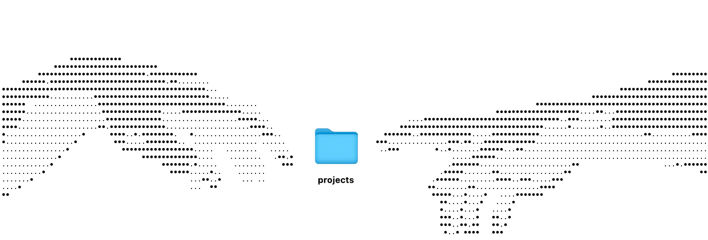

  <picture>
    <source media="(prefers-color-scheme: dark)" srcset="./assets/cover-image.jpeg">
    <source media="(prefers-color-scheme: light)" srcset="./assets/cover-image-light.jpeg">
    
  </picture>

  <h1>
    <code>echo "∆k∆sh"</code>
    &nbsp;&nbsp;|&nbsp;&nbsp;
    <a href="https://akasht.dev" target="_blank" style="color: #55555503">
      <code>ping akasht.dev</code>
    </a>
  </h1>

  <h3 style="font-size: 1.2rem; font-weight: 500; color: #888; margin-top: 10px;">
    Senior Frontend Engineer &nbsp;|&nbsp; Co-Founder @ <a href="https://journalx.io"><b>JournalX</b></a> &nbsp;|&nbsp; Ex-Zoho
  </h3>

  

    I am a product-focused engineer with <b>5+ years</b> of experience. 
    I specialize in building complex <b>React</b> & <b>Next.js</b> applications with a focus on <b>System Design</b> and <b>Performance</b>.  
    <em>Currently shipping <a href="https://journalx.io"><b>JournalX</b></a> – a blazing-fast trading journal SaaS for active traders.</em>
  

---

### 🛠 Tech Stack

<table>
  <tr>
    <td align="right"><b>Frontend</b></td>
    <td>
      &nbsp;
      &nbsp;
      &nbsp;
      
    </td>
  </tr>
  <tr>
    <td align="right"><b>State &amp; Data</b></td>
    <td>
      &nbsp;
      
    </td>
  </tr>
  <tr>
    <td align="right"><b>Backend &amp; Cloud</b></td>
    <td>
      &nbsp;
      &nbsp;
      &nbsp;
      
    </td>
  </tr>
</table>

---

### 🚀 Featured Projects

#### 📈 [JournalX (SaaS Trading Journal)](https://journalx.io)

_Co-Founder & Frontend Engineer_

- **Architecture:** Next.js, TypeScript, TanStack Query.
- **Key Challenge:** Built a custom anchor-based virtualization engine to render large datasets with **60FPS performance**.
- **Status:** In Beta, serving early-adopter traders with real-time analytics.

#### 🏢 Enterprise Modules @ Zoho (Previous)

- Optimized critical workflows for a platform serving **280k+ users**.
- Refactored legacy codebases to modern ES6+, reducing technical debt and support volume by **~50%**.

---

  
  &nbsp;&nbsp;
  
  &nbsp;&nbsp;
  
  &nbsp;&nbsp;
  
  &nbsp;&nbsp;
  <picture>
    <source media="(prefers-color-scheme: dark)" srcset="https://cdn.simpleicons.org/medium/white">
    <source media="(prefers-color-scheme: light)" srcset="https://cdn.simpleicons.org/medium/black">
    
  </picture>
  &nbsp;&nbsp;
  
  &nbsp;&nbsp;
  

